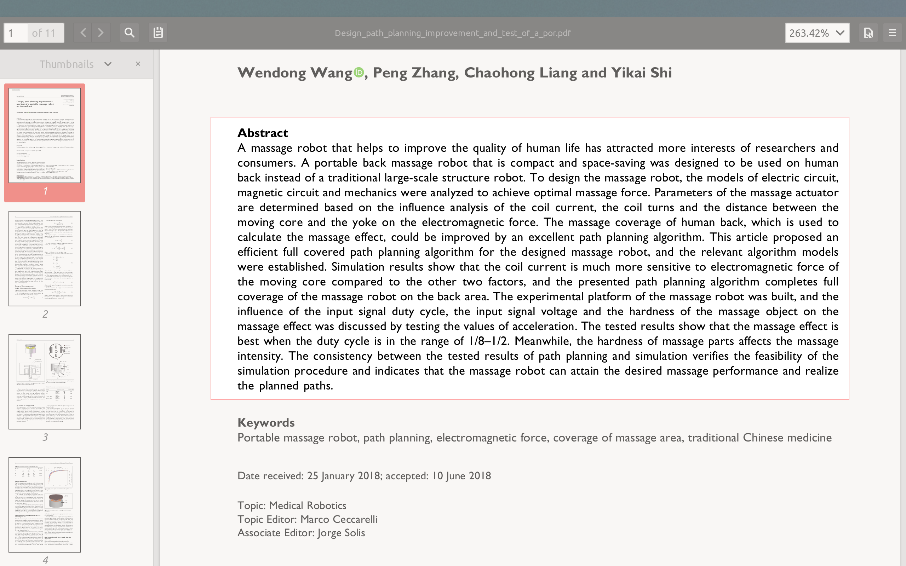
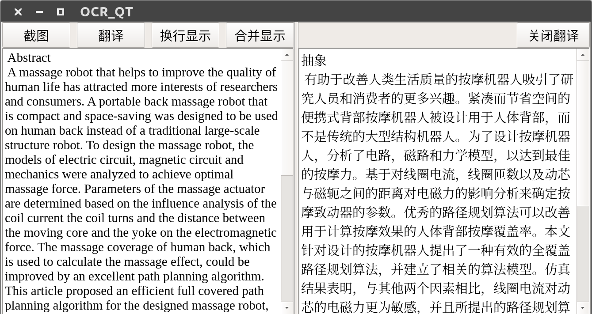

# Abstract
***an cross-platform OCR software developed by Qt***

this software used API by Baidu or Tencent to perform text recognition in the screenshot
After recognition,you can translate the sentence by google tranlation or youdao

## Build:

1. git this repository to your workspace and cd the git directory

2. open a terminal run `mkdir build\`

3. Next run `cmake ..`

4. Then run `make`

5. open a terminal and run `./ocr_qt`

## Usage
1. when you run this software, you can click the "截图" button to take a screenshot of the area that needs to be recognized. Also you can achieve this operation by shotcut("ctrl+q")
2. after screenshot,you will get the recognition result,and you can choose to translate these texts from English to Chinese by clicking the "翻译" button.
3. you can click the menubar to choose the recognition or tranlation platform.

## Example

* screenshot

* recognition and translation result

## development environment

* ubuntu16.04
* ubuntu18.04
