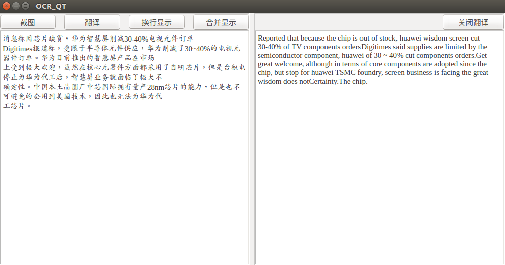

# Abstract
### an crossplat OCR software developed by Qt

this software used API by Baidu or Tencent to perform text recognition in the screenshot
After recognition,you can translate the sentence by google tranlation or youdao

# Usage:

1. git this repository to your workspace and cd the git directory

2. open a terminal run `mkdir build\`

3. Next `cmake ..`

4. Then `make`

## Example

## development environment

ubuntu16.04
